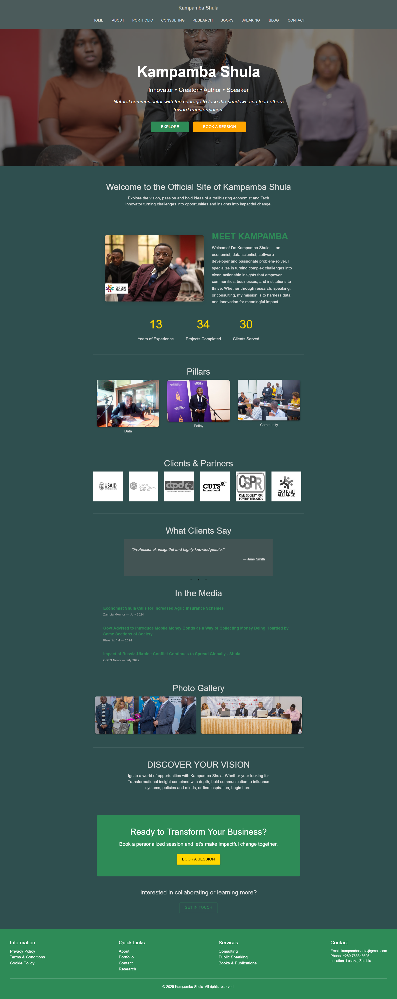

# Kampamba Shula Personal Website

Welcome to the official repository for **Kampamba Shula’s personal website** – a portfolio and professional showcase highlighting research, consulting, speaking, and tech projects.

---

## Table of Contents

- [Overview](#overview)  
- [Features](#features)  
- [Tech Stack](#tech-stack)  

---

## Overview

This website is the digital presence for Kampamba Shula, showcasing  work as an **economist, data scientist, software developer, and public speaker**. It includes a modern, responsive design with interactive sections, animated highlights, blog integration, and media features.

---

## Features

- **Full-Screen Hero Section** with sliding taglines  
- **About & Mission Sections** to highlight professional vision  
- **Photo Gallery & Carousel** for projects and events  
- **Clients Section** with partner logos  
- **Blog Section** with social media sharing  
- **Animated Impact Stats** (years of experience, projects, clients served)  
- **Skills & Service Cards**  
- **Testimonials Carousel**  
- **Contact & Call-to-Action Sections**  
- **Footer** with quick links and contact info  

---

## Tech Stack

- **Frontend:** React, Material-UI  
- **Routing:** React Router DOM  
- **Animations:** CSS transitions & keyframes, `react-countup` (for animated stats)  
- **Social Sharing:** `react-share`  

---
